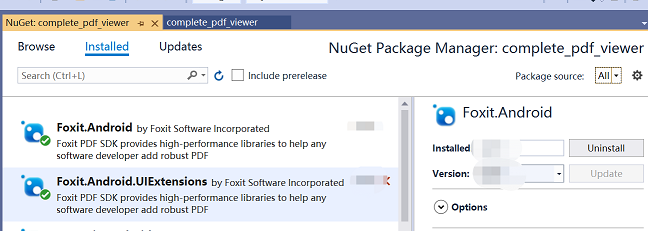
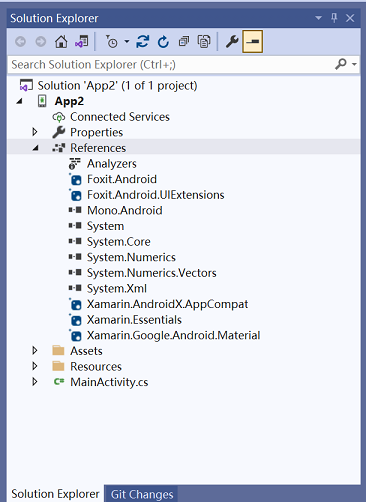
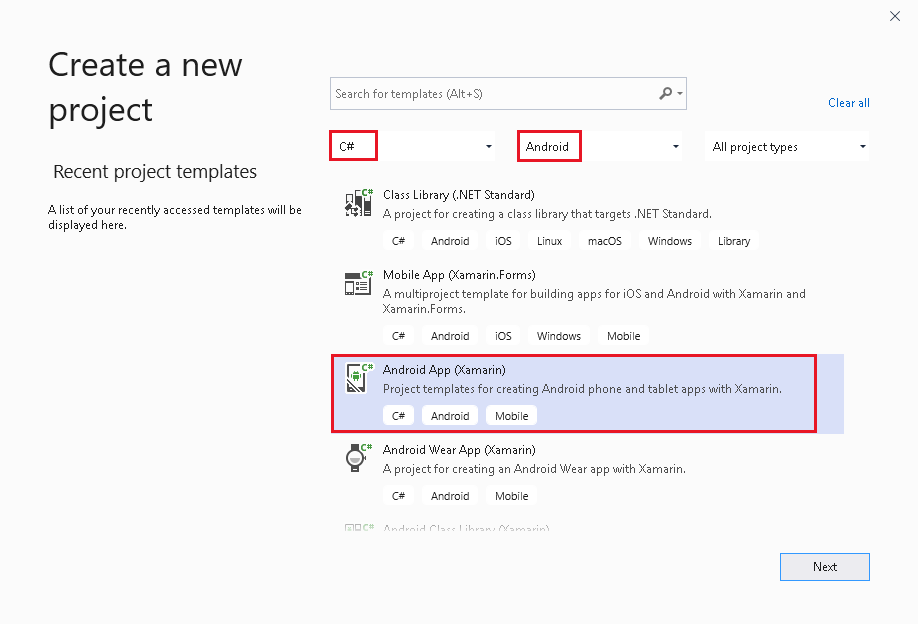

## Implement Foxit PDF SDK for Android using Xamarin/.NET
Welcome to foxit. This guide will show you how to integrate Foxit PDF SDK for Android into your Xamarin.Android/.NET Android application.   
Let's take creating a xamarin demo as an example, similar to .NET

- [System Requirements](#System-Requirements)
- [Integrate Foxit PDF SDK into your Xamarin.NET project](#Integrate-Foxit-PDF-SDK-into-your-Xamarin-project)
- [Build a Xamarin Android project using Foxit PDF SDK for Android](#Build-a-Xamarin-Android-project-using-Foxit-PDF-SDK-for-Android)
- [How to run the complete_pdf_viewer](#How-to-run-the-complete_pdf_viewer)
- [Xamarin Demo](#Xamarin-Demo)
- [.NET Demo](#.NET-Demo)
- [Issues](#Issues)
- [More](#More)
- [License](#License)

## Prerequisites

* __Visual Studio__  
  Foxit PDF SDK Version >= 8.4.0: __Visual Studio 2022 and above__  
  Foxit PDF SDK Version < 8.4.0: __Visual Studio 2019 and above__  
* __TargetFrameworkVersion >= Android 10.0__  
       
* __Minimum Android Version: API 19 (Android4.4)__  
* __JDK Version >= 1.8__


## Integrate Foxit PDF SDK into your Xamarin project
**There are two ways to integrate Foxit PDF SDK into your Xamarin project:**
- [Install By NuGet](#Install-By-NuGet)

  #### ***Install By NuGet***
  It is now possible to integrate Foxit PDF SDK into your Xamarin project through NuGet packages, which is much easier than the second way [Integrate manually by building and referencing DLLs](#Integrate-manually-by-building-and-referencing-DLLs) , and can save
you much time.  
  
  To integrate Foxit PDF SDK into your Xamarin project through Nuget packages, please follow the steps below:  
  - In the Solution Explorer, right-click the References node of your project, and click `Manage NuGet Packages…`
 
    
  -  Then select the Browse tab, search for `Foxit.Android`, `Foxit.Android.UIExtensions` and install them.  
  
     
   -  Get key. If you do not already have a valid Foxit license key, please download `foxitpdfsdk_(version_no)_android.zip` from [https://developers.foxitsoftware.com/pdf-sdk/android/](https://developers.foxitsoftware.com/pdf-sdk/android/) to get the key.  
   
   After finishing the above steps, the References of your project will look like:  
     
   
   ***
   
  
## Build a Xamarin/.NET Android project using Foxit PDF SDK for Android
**This section will help you to quickly build a full-featured PDF Reader in Xamarin Android platform with
step-by-step instructions provided.**

- [Create a new Xamarin Android project](#1-Create-a-new-Xamarin-Android-project)
- [Integrate Foxit PDF SDK into the project](#2-Integrate-Foxit-PDF-SDK-into-the-project)
- [Initialize Foxit PDF SDK Library](#3-Initialize-Foxit-PDF-SDK-Library)
- [Display a PDF document using PDFViewCtrl](#4-Display-a-PDF-document-using-PDFViewCtrl)

#### 1. Create a new Xamarin Android project
Open Visual Studio 2019, choose `File -> New -> Project… `  to start the New Project. Let's take `TestXamarin` as an example .Create a new Xamarin Android project called `TestXamarin` ,Then click OK:  

  

In the New Android App dialog, select Single View App,Then, click OK:  

  

#### 2. Integrate Foxit PDF SDK into the project
Please refer to [Integrate Foxit PDF SDK into your Xamarin project](#Integrate-Foxit-PDF-SDK-into-your-Xamarin-project) to integrate the Foxit PDF SDK into the created project. We recommend using the first way [Integrate with NuGet](#Install-By-NuGet), which is more
easy and convenient.
#### 3. Initialize Foxit PDF SDK Library
Before calling any APIs, you must first initialize Foxit PDF SDK library by using the function
Library.Initialize(sn, key). Below you can see an example of how to initialize the SDK library. The
next section will show you where to include this code in `MainActivity.cs` file:
```
using Com.Foxit.Sdk;
using Com.Foxit.Sdk.Common;
...
String sn = "xxx";
String key = "xxx";
int errCode = Library.Initialize(sn, key);
if (errCode != Constants.EErrSuccess)
return;
```
Note: The value of `sn` can be found in the `rdk_sn.txt` (the string after `SN=`) and the value of `key` can be found
in the `rdk_key.txt` (the string after `Sign=`). The trial license files (rdk_sn.txt and rdk_key.txt) can be found in the
`foxit_xamarin_android\libs` folder or in the `libs` folder of Foxit PDF SDK for Android package

#### 4. Display a PDF document using PDFViewCtrl
To display a PDF document, please follow the steps below:  

 **1) Instantiate a PDFViewCtrl object to show an existing document.**  
  In `MainActivity.cs` file, instantiate a PDFViewCtrl object, and call `PDFViewCtrl#OpenDoc` function to open and render the PDF document:  

```
using Com.Foxit.Sdk;
...
private String path = "/mnt/sdcard/complete_pdf_viewer_guide_android.pdf";
private PDFViewCtrl pdfViewCtrl;
...
// Instantiate a PDFViewCtrl object.
pdfViewCtrl = new PDFViewCtrl(this.ApplicationContext);
// Open and Render a PDF document.
pdfViewCtrl.OpenDoc(path, null);
SetContentView(pdfViewCtrl);
```
Note: Please make sure you have pushed the [complete_pdf_viewer_guide_android.pdf](https://github.com/foxitsoftware/xamarin-foxitpdf/tree/master/foxit_xamarin_android/complete_pdf_viewer/complete_pdf_viewer/Assets/complete_pdf_viewer_guide_android.pdf)
document into the SD card of the Android device or emulator that will be used to run this project. Certainly, you can
change the file path with your own files.

Update MainActivity.cs as follows:
```
using System;
using Android.App;
using Android.OS;
using AndroidX.AppCompat.App;
using Com.Foxit.Sdk;
using Com.Foxit.Sdk.Common;
namespace TestXamarin
{
[Activity(Label = "@string/app_name", Theme = "@style/AppTheme.NoActionBar",MainLauncher = true)]
    public class MainActivity : AppCompatActivity
    {
        // The value of "sn" can be found in the "rdk_sn.txt".
        // The value of "key" can be found in the "rdk_key.txt".
        private String sn = "xxx";
        private String key = "xxx";
        private String path = "/mnt/sdcard/complete_pdf_viewer_guide_android.pdf";
        private PDFViewCtrl pdfViewCtrl;
        protected override void OnCreate(Bundle savedInstanceState)
        {
            base.OnCreate(savedInstanceState);
               // Initialize Foxit SDK Library.
               int errCode = Library.Initialize(sn, key);
               if (errCode != Constants.EErrSuccess)
                   return;
               // Instantiate a PDFViewCtrl object.
               pdfViewCtrl = new PDFViewCtrl(this.ApplicationContext);
               // Open and Render a PDF document.
               pdfViewCtrl.OpenDoc(path, null);
               SetContentView(pdfViewCtrl);
        }
    }
}
```
**2) Set permissions to write and read the SD card of the Android devices or emulators**  
Note: If you want to run this project on an Android 6.0 (API 23) or higher devices/emulators, you
can do one of the following:
- **a)** Change the android:targetSdkVersion in "AndroidManifest.xml" to a lower SDK version
that is less than 23, such as 21
- **b)** Write additional code to require the authorization of runtime permissions.  

- _**a) Change the android:targetSdkVersion in  `AndroidManifest.xml`**_
  
    In this case, set the `users-permission` in the `AndroidManifest.xml` found in the
`TestXamarin\Properties` to give the project permission to write and read the SD card of the Android devices or emulators:  
     
```
<uses-permission android:name="android.permission.WRITE_EXTERNAL_STORAGE"/>
<uses-permission android:name="android.permission.READ_EXTERNAL_STORAGE"/>
```
- _**b) Write additional code to require the authorization of runtime permissions.**_  
   In the `MainActivity.cs`  file, add code to require the authorization of runtime permissions.   
   So, update the whole MainActivity.cs as follows:
 ```
    using System;
    using Android.App;
    using Android.OS;
    using Android.Runtime;
    using AndroidX.AppCompat.App;
    using Com.Foxit.Sdk;
    using Com.Foxit.Sdk.Common;
    using Android;
    using Android.Content.PM;
    using AndroidX.Core.Content;
    using AndroidX.Core.App;
    namespace TestXamarin
    {
    [Activity(Label = "@string/app_name", Theme = "@style/AppTheme.NoActionBar",MainLauncher = true)]
        public class MainActivity : AppCompatActivity
        {
            public static int REQUEST_EXTERNAL_STORAGE = 1;
            private static string[] PERMISSIONS_STORAGE = {
                    Manifest.Permission.ReadExternalStorage,
                    Manifest.Permission.WriteExternalStorage
            };
           // The value of "sn" can be found in the "rdk_sn.txt".
           // The value of "key" can be found in the "rdk_key.txt".
            private String sn = "xxx";
            private String key = "xxx";
            private String path = "/mnt/sdcard/complete_pdf_viewer_guide_android.pdf";
            private PDFViewCtrl pdfViewCtrl;
            protected override void OnCreate(Bundle savedInstanceState)
            {
                base.OnCreate(savedInstanceState);
                // Initialize Foxit SDK Library.
                int errCode = Library.Initialize(sn, key);
                if (errCode != Constants.EErrSuccess)
                    return;
                // Instantiate a PDFViewCtrl object.
                pdfViewCtrl = new PDFViewCtrl(this.ApplicationContext);
                // Require the authorization of runtime permissions.
                if (Build.VERSION.SdkInt > BuildVersionCodes.M)
                {
                    Permission permission =
                            ContextCompat.CheckSelfPermission(this.ApplicationContext,
                                    Manifest.Permission.WriteExternalStorage);
                    if (permission != Permission.Granted)
                    {
                        ActivityCompat.RequestPermissions(this, PERMISSIONS_STORAGE,
                                REQUEST_EXTERNAL_STORAGE);
                        return;
                    }
                }
                // Open and Render a PDF document.
                pdfViewCtrl.OpenDoc(path, null);
                SetContentView(pdfViewCtrl);
            }
            public override void OnRequestPermissionsResult(int requestCode, string[] permissions, [GeneratedEnum] Permission[] grantResults)
            {
                if (requestCode == REQUEST_EXTERNAL_STORAGE
                        && grantResults[0] == Permission.Granted)
                {
                    if (pdfViewCtrl != null)
                    {
                        pdfViewCtrl.OpenDoc(path, null);
                    }
                }
                else
                {
                    base.OnRequestPermissionsResult(requestCode, permissions,
                            grantResults);
                }
            }
        }
    }
```
**3) Enable Multi-Dex. If you don't, you may encounter the problem "error MSB6006: "java.exe" exited with code 2.**  
Right-click the `Properties` node of TestXamarin project, find `Android Options` then check `Enable Multi-Dex` and set `Dex compiler` to d8:  

  

In this chapter, we build and run the project on an AVD targeting 9.0 (API 28), and use the second
method (require authorization of runtime permissions) to get the permissions to write and read the SD
card of the emulator.  

After building the project and installing APK on the emulator, tap Allow on the pop-up window to allow
the project to access files on the device, and then you will see that the `complete_pdf_viewer_guide_android.pdf` document is displayed . Now, this
sample app has some basic PDF features, such as zooming in/out and page turning.  

 

## How to run the complete_pdf_viewer

1: Download `foxitpdfsdk_(version_no)_android.zip` from [https://developers.foxitsoftware.com/pdf-sdk/android/](https://developers.foxitsoftware.com/pdf-sdk/android/), then unzip the `foxitpdfsdk_(version_no)_android.zip`, and enter the `libs` directory,copy the following files into the `foxit_xamarin_android/libs` directory:  

* `rdk_key.txt`
* `rdk_sn.txt`  

2:   
__2.1: Xamarin Demo__ `Run` the `FoxitRDKDemo.Xamarin\complete_pdf_viewer.sln` project in the simulator or on a physical device.  
__2.2: .NET Demo__ `Run` the `FoxitRDKDemo.Net\complete_pdf_viewer.sln` project in the simulator or on a physical device.  

## Xamarin Demo
Please refer to `FoxitRDKDemo.Xamarin\complete_pdf_viewer.sln` project.

## .NET Demo
Please refer to `FoxitRDKDemo.Net\complete_pdf_viewer.sln` project.

## Issues

#### 1: java.lang.OutOfMemoryError. Consider increasing the value of $(JavaMaximumHeapSize)

Solution：Right-click the `Properties` node of your project, and open it. Find `Android Options` and click `Advanced` button find `Java Max Heap Size` set it to 2G. As show below:  

  

#### 2: invalid opcode ba - invokedynamic requires --min-sdk-version >= 26 (currently 13), Cannot fit requested classes in a single dex file (# methods: 87605 > 65536)

Solution：Right-click the `Properties` node of your project, and open it. Find `Android Options` and check `Enable Multi-Dex` and set `Dex compiler` to d8. As show below:  

  

#### 3: Attribute application@theme value=(@style/AppTheme) from AndroidManifest.xml is also present at AndroidManifest.xml value=(@style/fx_app_theme).

Suggestion: add 'tools:replace="android:theme"' to <application> element at AndroidManifest.xml.  

 ```diff
   <manifest xmlns:android="http://schemas.android.com/apk/res/android"
+             xmlns:tools="http://schemas.android.com/tools"
              ...>
   
      ...
      ...
   
       <application
           ...
+          tools:replace="android:theme">
           ...
       </application>
   </manifest>
```  
 
## More
For more usage of xamarin, you can refer to  `foxitpdfsdk_(version_no)_android\docs\developer_guide_android.pdf` the section 9.3 . the `foxitpdfsdk_(version_no)_android.zip` can download from [https://developers.foxitsoftware.com/pdf-sdk/android/](https://developers.foxitsoftware.com/pdf-sdk/android/)  

  
## License

### lisense for Cropper
[https://github.com/edmodo/cropper](https://github.com/edmodo/cropper)

Copyright 2013, Edmodo, Inc.

    Licensed under the Apache License, Version 2.0 (the "License"); you may not  
    use this work except in compliance with the License. You may obtain a copy  
    of the License in the LICENSE file, or at:
      
    http://www.apache.org/licenses/LICENSE-2.0  
      
    Unless required by applicable law or agreed to in writing, software   
    distributed under the License is distributed on an "AS IS" BASIS, WITHOUT   
    WARRANTIES OR CONDITIONS OF ANY KIND, either express or implied. See the   
    License for the specific language governing permissions and limitations   
    under the License.

### lisense for ADAL
[https://github.com/AzureAD/azure-activedirectory-library-for-android](https://github.com/AzureAD/azure-activedirectory-library-for-android)

Copyright (c) Microsoft Corporation.
     
    All rights reserved. This code is licensed under the MIT License.
      
    We Value and Adhere to the Microsoft Open Source Code of Conduct  
       
    This project has adopted the Microsoft Open Source Code of Conduct. For   
    more information see the Code of Conduct FAQ or contact opencode@microsoft  
    .com with any additional questions or comments.

### lisense for GSON
[https://github.com/google/gson](https://github.com/google/gson)

Copyright 2008 Google Inc.

    Licensed under the Apache License, Version 2.0 (the "License");
    you may not use this file except in compliance with the License.
    You may obtain a copy of the License at  
      
      http://www.apache.org/licenses/LICENSE-2.0  
      
    Unless required by applicable law or agreed to in writing, software
    distributed under the License is distributed on an "AS IS" BASIS,
    WITHOUT WARRANTIES OR CONDITIONS OF ANY KIND, either express or implied.
    See the License for the specific language governing permissions and
    limitations under the License.
    
### lisense for RxAndroid
[https://github.com/ReactiveX/RxAndroid](https://github.com/ReactiveX/RxAndroid)

Copyright 2015 The RxAndroid authors

    Licensed under the Apache License, Version 2.0 (the "License");
    you may not use this file except in compliance with the License.
    You may obtain a copy of the License at
    
        http://www.apache.org/licenses/LICENSE-2.0
    
    Unless required by applicable law or agreed to in writing, software
    distributed under the License is distributed on an "AS IS" BASIS,
    WITHOUT WARRANTIES OR CONDITIONS OF ANY KIND, either express or implied.
    See the License for the specific language governing permissions and
    limitations under the License.

### lisense for Xcrash
[https://github.com/iqiyi/xCrash](https://github.com/iqiyi/xCrash)

xCrash is MIT licensed, as found in the [LICENSE](https://github.com/iqiyi/xCrash/blob/master/LICENSE) file.

xCrash documentation is Creative Commons licensed, as found in the [LICENSE-docs](https://github.com/iqiyi/xCrash/blob/master/LICENSE-docs) file.

